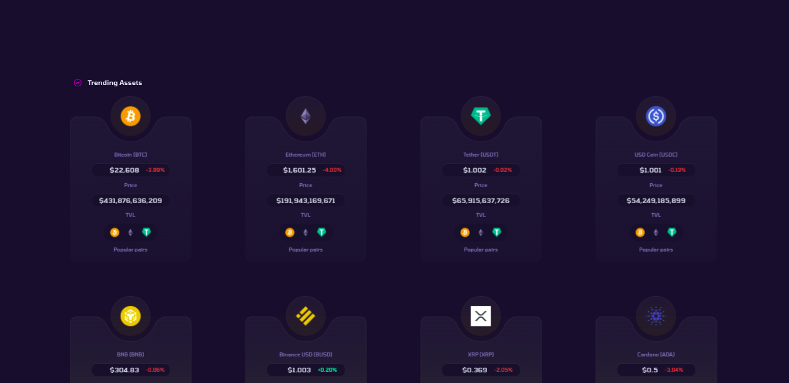

# Api for getting assets data

The api used is provided by [coingecko](https://www.coingecko.com/en/api/documentation).

Endpoint
`https://api.coingecko.com/api/v3/coins/markets?vs_currency=inr&order=market_cap_desc&per_page=100&page=1&sparkline=false`

# Output

